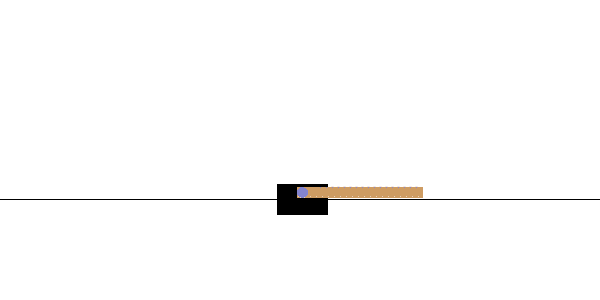

## 基于iLQR的倒立摆控制

本项目使用迭代线性二次调节器(iLQR)算法实现了倒立摆系统的最优控制。在OpenAI Gym的CartPole环境中进行了仿真验证。项目实现了基于autograd和JAX两套自动微分方案，其中利用JAX的即时编译(JIT)功能显著提升了程序的实时性能。



### 环境

* python3.9
* gym
* jax

依赖安装：

```bash
pip install requirements.txt
```

### 运行

即时编译版：

```bash
python cartpole.py
```

autograd版：

```bash
python cartpole_autograd.py
```